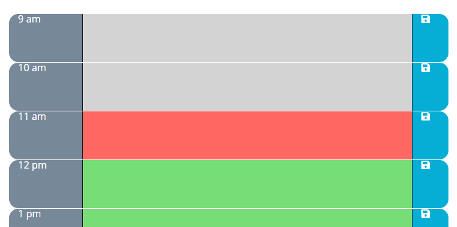

## Day-Calendar

This projects goal was to build responsive and dynamic day-calendar. The focus was using getting experience using JQuery and MomentJS. For responsive design, Bootstrap Grid was used.

## Challenges

The biggest challenge for me on this project was the goal I had to allow the day-calendar to be able to be adjusted to the desired hours for the work day. That feature is currently done on the JavaScript file but plan to add two input boxes on the UI where the user can input their desired working hours.

## Project Links

https://github.com/chadclark1234/Day-Calendar

https://chadclark1234.github.io/Day-Calendar/

